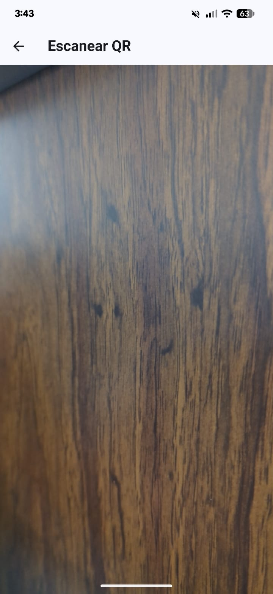
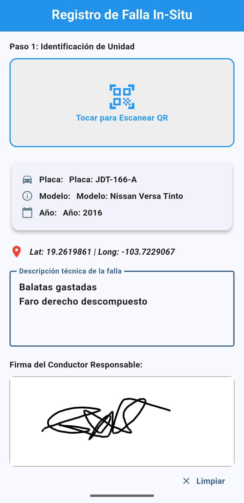
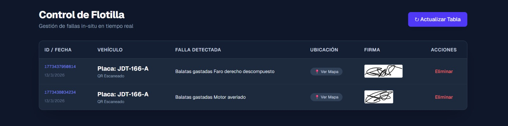

# 🛠️ Sistema de Reporte de Fallas Vehiculares

Aplicación móvil orientada a la gestión técnica de flotas y talleres. Permite la digitalización inmediata de reportes de fallas mediante escaneo de hardware vehicular, geolocalización por GPS y firma digital del responsable.

Los reportes son centralizados en un **Panel de Administración** alojado en **Vercel**, donde se visualizan los incidentes en tiempo real sobre un mapa interactivo.

---

## 📱 Características de la App

* **🔍 Escaneo QR de Diagnóstico:** Al escanear el código de la computadora del vehículo, la app recupera automáticamente:
    * Placa
    * Modelo
    * Año del vehículo
* **📝 Registro Técnico:** Formulario dinámico para la descripción detallada de la falla detectada.
* **📍 Geolocalización Automática:** Captura mediante GPS de la posición exacta (latitud/longitud) donde se genera el reporte.
* **✍️ Firma Digital:** Panel táctil para la firma autógrafa del conductor o técnico responsable.
* **📤 Envío en Tiempo Real:** Sincronización inmediata con el servidor para la gestión administrativa.

---

## 🧠 Flujo de Trabajo

1.  **Sincronización:** El usuario escanea el código QR del vehículo.
2.  **Diagnóstico:** Se ingresa la descripción técnica de la falla.
3.  **Validación:** El sistema obtiene la ubicación GPS y solicita la firma.
4.  **Finalización:** Se genera el reporte y se envía al administrador.

---

## 🖥️ Panel Administrativo (Vercel)

El administrador cuenta con una interfaz web donde puede:
* Ver el listado histórico de reportes.
* Visualizar un **Mapa de Incidentes** para identificar zonas con mayor frecuencia de fallas.
* Consultar los detalles técnicos, fotos de firmas y datos del vehículo.

---

## 🛠️ Stack Tecnológico

* **Mobile:** Flutter / Dart (o tu tecnología actual).
* **Web Dashboard:** React / Next.js (Desplegado en Vercel).
* **Servicios:** Google Maps API (Geolocalización).

---

## 📸 Capturas de Pantalla

| Escaneo de QR | Datos Falla y Coordenadas | Reporte | Panel Admin |
| :---: | :---: | :---: | :---: |
|  |  |  |  |
---

> **Nota:** Este proyecto fue desarrollado como solución tecnológica para la gestión eficiente de mantenimientos vehiculares.
